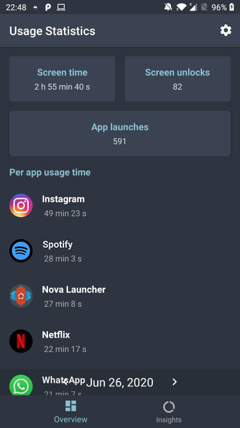

# Screen Health: A digital well-being application

University project - An Android application that tracks, analyses and displays app usage data, as well as show warnings when the user is using the device for an extended period of time. Inspired by Google's [Digital Wellbeing](https://wellbeing.google/) project.

## Sample screenshot

